# Class Diagram — ClassSync AI

## Overview

This document presents the **UML Class Diagram** for the ClassSync AI system. It details the static structure of the system, including the data models, the core genetic algorithm engine, and the agent interaction layer.

## Diagram

```mermaid
classDiagram
    %% =================================================================================
    %% DOMAIN MODELS (Data Layer)
    %% =================================================================================
    namespace Models {
        class Institution {
            +int id
            +String name
            +String code
            +SubscriptionTier subscription_tier
            +DateTime subscription_expires_at
            +List~User~ users
            +List~ConstraintConfig~ constraint_configs
        }

        class User {
            +int id
            +int institution_id
            +String email
            +String hashed_password
            +UserRole role
            +Boolean is_active
        }

        class ConstraintConfig {
            +int id
            +String name
            +Boolean is_active
            +int timeslot_duration_minutes
            +JSON hard_constraints
            +JSON soft_constraints
            +JSON optional_constraints
            +int max_optimization_time_seconds
        }

        class Teacher {
            +int id
            +String name
            +String code
            +JSON time_preferences
        }

        class Room {
            +int id
            +String code
            +RoomType room_type
            +int capacity
            +Boolean is_available
        }

        class Course {
            +int id
            +String code
            +String name
            +CourseType course_type
            +int credit_hours
            +int duration_minutes
            +int sessions_per_week
        }

        class Section {
            +int id
            +String code
            +int student_count
            +int course_id
        }

        class Timetable {
            +int id
            +TimetableStatus status
            +float constraint_score
            +float generation_time_seconds
            +int conflict_count
            +List~TimetableEntry~ entries
        }

        class TimetableEntry {
            +int id
            +int day_of_week
            +String start_time
            +String end_time
            +int room_id
            +int teacher_id
            +int section_id
        }
        
        class Dataset {
            +int id
            +String filename
            +DatasetStatus status
            +JSON validation_errors
            +String s3_key
        }
    }

    %% Relationships
    Institution "1" -- "*" User : has
    Institution "1" -- "*" ConstraintConfig : owns
    Institution "1" -- "*" Timetable : generates
    Institution "1" -- "*" Course : defines
    Institution "1" -- "*" Teacher : employs
    Institution "1" -- "*" Room : owns
    Institution "1" -- "*" Section : has
    Institution "1" -- "*" Dataset : stores

    Course "1" -- "*" Section : has
    Timetable "1" -- "*" TimetableEntry : contains
    TimetableEntry "*" -- "1" Room : assigned to
    TimetableEntry "*" -- "1" Teacher : assigned to
    TimetableEntry "*" -- "1" Section : assigned to
    TimetableEntry "*" -- "1" Course : for

    %% =================================================================================
    %% CORE SCHEDULER ENGINE (Logic Layer)
    %% =================================================================================
    namespace SchedulerCore {
        class TimetableOptimizer {
            +ConstraintConfig constraint_config
            +String strategy
            +generate_timetable(db: Session, institution_id: int) Dict
            -_run_ga()
            -_run_heuristic()
            -_run_hybrid()
            -_save_to_database()
        }

        class GAEngine {
            +GAConfig config
            +run(population_size: int, generations: int) Dict
            -_create_next_generation()
            -_tournament_selection()
        }

        class GAConfig {
            +List~String~ working_days
            +String day_start_time
            +String day_end_time
            +int slot_duration_minutes
            +float min_acceptable_fitness
        }

        class PopulationInitializer {
            +create_population(size: int) List~Chromosome~
            -_create_random_chromosome()
            -_create_heuristic_chromosome()
        }

        class FitnessEvaluator {
            +evaluate(chromosome: Chromosome) float
            -_check_hard_constraints() Dict
            -_calculate_soft_scores() Dict
            -_score_teacher_availability()
            -_score_minimize_gaps()
        }

        class PreGAValidator {
            +validate() ValidationResult
            -_validate_locked_assignment_conflicts()
            -_validate_instructor_weekly_load()
        }

        class GeneticOperators {
            +crossover(parent1, parent2) Tuple
            +mutate(chromosome, generation) Chromosome
        }
        
        class Chromosome {
            +List~Gene~ genes
            +float fitness
            +Boolean is_feasible
            +Dict hard_violations
            +Dict soft_scores
            +copy() Chromosome
        }

        class Gene {
            +String session_key
            +int course_id
            +String day
            +String start_time
            +int room_id
            +Boolean is_locked
            +update_time(day, start)
            +update_room(room_id)
        }
    }

    %% Relationships
    TimetableOptimizer --> GAEngine : uses
    TimetableOptimizer --> PreGAValidator : validates with
    GAEngine --> PopulationInitializer : uses
    GAEngine --> FitnessEvaluator : uses
    GAEngine --> GeneticOperators : uses
    GAEngine --> GAConfig : configured by
    FitnessEvaluator --> Chromosome : scores
    Chromosome "1" *-- "*" Gene : consists of

    %% =================================================================================
    %% AGENT LAYER (AI Interaction)
    %% =================================================================================
    namespace AgentLayer {
        class AIInteractionLog {
            +int id
            +String user_input
            +String tool_called
            +String agent_action
        }

        class LLMClient {
            +query(prompt: String, context: Dict) String
            +call_tool(tool_name: String, args: Dict)
        }

        class AgentTools {
            <<Interface>>
            +validate_data()
            +update_constraint()
            +run_scheduler()
            +simulate_scenario()
            +explain_slot()
        }
    }

    Institution "1" -- "*" AIInteractionLog : logs
    LLMClient ..> AgentTools : invokes

    %% =================================================================================
    %% API LAYER (Controllers)
    %% =================================================================================
    namespace API {
        class SchedulerRouter {
            +generate_timetable()
            +get_status()
            +export_result()
        }

        class ConstraintsRouter {
            +get_constraints()
            +update_constraints()
            +reset_constraints()
        }
        
        class DatasetsRouter {
            +upload_dataset()
            +get_validation_status()
        }
    }

    SchedulerRouter ..> TimetableOptimizer : delegates to
    ConstraintsRouter ..> Models.ConstraintConfig : manages
    DatasetsRouter ..> Models.Dataset : manages

```

## Key Components Description

1.  **Domain Models**: These classes map directly to the database schema. The central entity is the `Institution`, which holds all data for a specific university tenant. The `Timetable` entity is the output of the system, containing thousands of `TimetableEntry` records.

2.  **Scheduler Core**: This is the engine room.
    *   `TimetableOptimizer`: The facade that sets up the problem.
    *   `GAEngine`: Orchestrates the evolutionary process.
    *   `FitnessEvaluator`: The most complex component, translating academic rules into a numerical score (0-1000).
    *   `Chromosome` & `Gene`: represent the scheduling solution. A `Gene` is a single class session assignment.

3.  **Agent Layer**: Handles natural language interaction. It doesn't modify the database directly but calls "Tools" (like `update_constraint`) which then interact with the core logic.

4.  **API Layer**: FastAPI routers that expose the functionality to the frontend.
