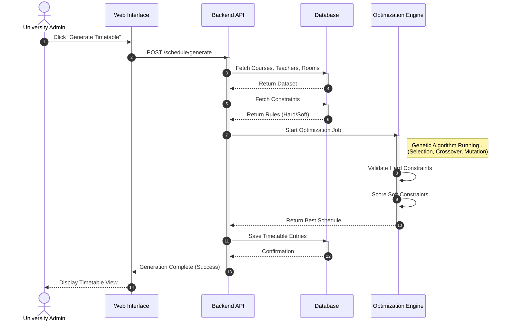
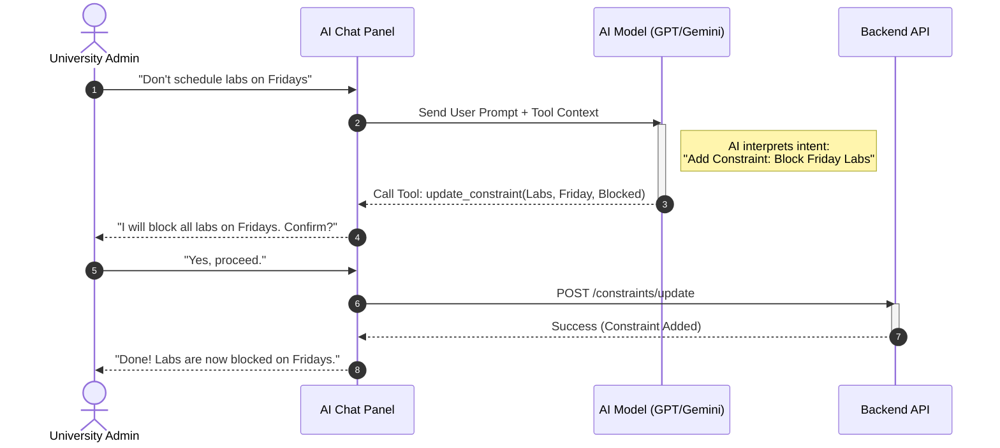

# Sequence Diagrams — ClassSync AI

## Overview

This document presents Sequence Diagrams for **ClassSync AI**. These diagrams illustrate the step-by-step flow of messages between the user, the interface, and the system components to complete specific tasks.

---

## 1. Timetable Generation Workflow

This diagram shows the core process: how the system takes user input, runs the optimization engine, and saves the result.

### Explanation
1.  **Initiation**: The Admin starts the process from the dashboard.
2.  **Preparation**: The Backend gathers all necessary data (who is teaching what, which rooms are available) and the rules (constraints) from the database.
3.  **Execution**: The "Brain" (Optimization Engine) runs the Genetic Algorithm. It iteratively improves the schedule until it finds a conflict-free solution.
4.  **Completion**: The best schedule is sent back to the API.
5.  **Saving**: The result is permanently stored in the database, and the user sees the final timetable.

---

## 2. AI-Assisted Configuration Workflow

This diagram shows how the AI Agent helps the user modify rules using natural language.

### Explanation
1.  **User Request**: The user speaks naturally, asking for a change.
2.  **Interpretation**: The AI translates the English sentence into a specific system command.
3.  **Confirmation**: For safety, the system asks the user to confirm the change before applying it.
4.  **Execution**: The system updates the rules in the background.
5.  **Feedback**: The user is notified that the rule is now active.
