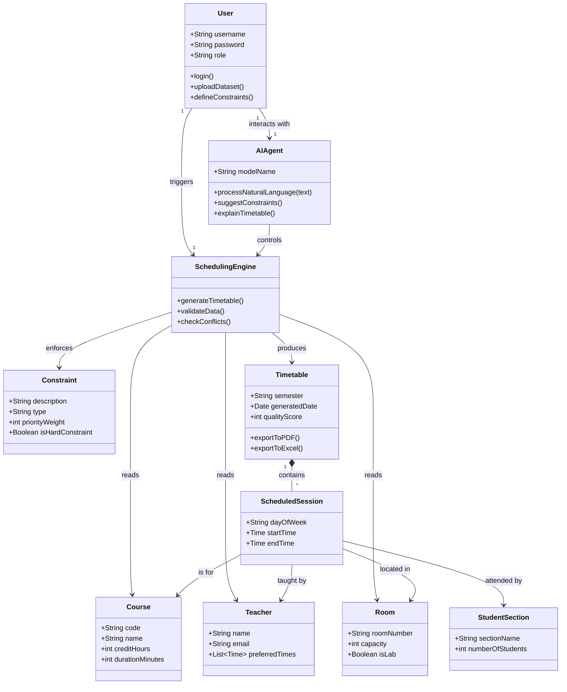

# Simple Class Diagram — ClassSync AI

## Overview

This is a simplified logical class diagram for the ClassSync AI system. It focuses on the core business entities and their relationships, abstracting away complex implementation details. This view is suitable for understanding the high-level design of the system without needing knowledge of the specific algorithms used.

## Diagram

## Explanation for Non-Technical Stakeholders

1.  **User & Agent**: The **User** (Admin) logs in and provides data. They can talk to the **AIAgent** (like a chatbot) to ask for changes or explanations in plain English.
2.  **Scheduling Engine**: This is the "brain" of the system. It takes all the inputs and rules and works to build the schedule.
3.  **Input Data**: These are the building blocks:
    *   **Courses**: What needs to be taught.
    *   **Teachers**: Who teaches.
    *   **Rooms**: Where it happens.
    *   **Student Sections**: Who attends.
4.  **Constraints**: The rules of the game (e.g., "No classes on Friday evenings", "Teacher X cannot teach during lunch").
5.  **Timetable (Output)**: The final result. It consists of many **Scheduled Sessions**. A single session ties everything together: *Course A* is taught by *Teacher B* in *Room C* for *Section D* on *Monday at 9 AM*.
